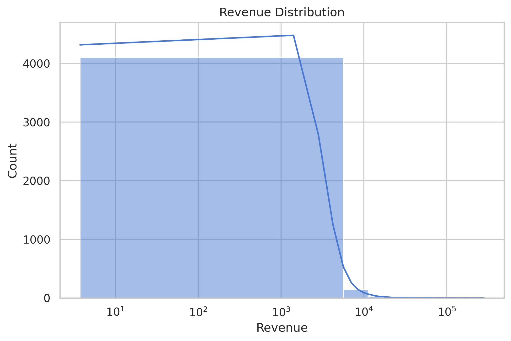
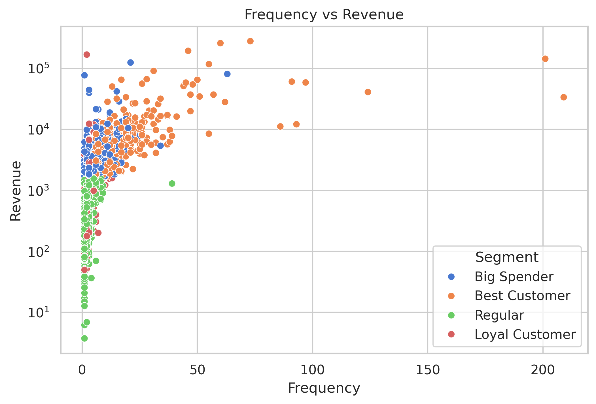
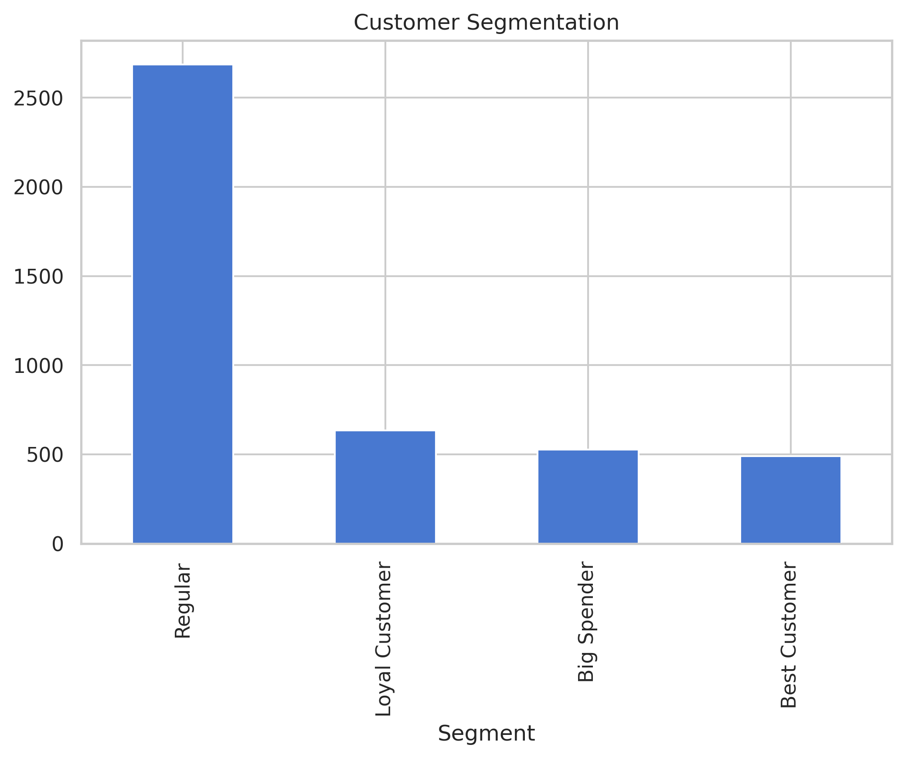

# Customer Segmentation Analysis (RFM)

## Overview
This project analyzes customer transaction data using RFM (Recency, Frequency, Monetary) to identify customer segments and generate business insights.

## Objectives
- Identify high-value customers
- Understand customer purchasing behavior
- Provide data-driven business insights

## Tools
- Python (Pandas, Matplotlib, Seaborn)

## Key Insights
- Majority of customers are low-frequency buyers
- High-value customers contribute most of the revenue
- Customer segmentation enables targeted marketing strategies

## Visualizations

### Revenue Distribution

### Frequency vs Revenue

### Customer Segmentation

## Business Recommendations
- Focus retention strategies on high-value customers
- Improve engagement for low-frequency customers
- Develop loyalty programs for repeat buyers
